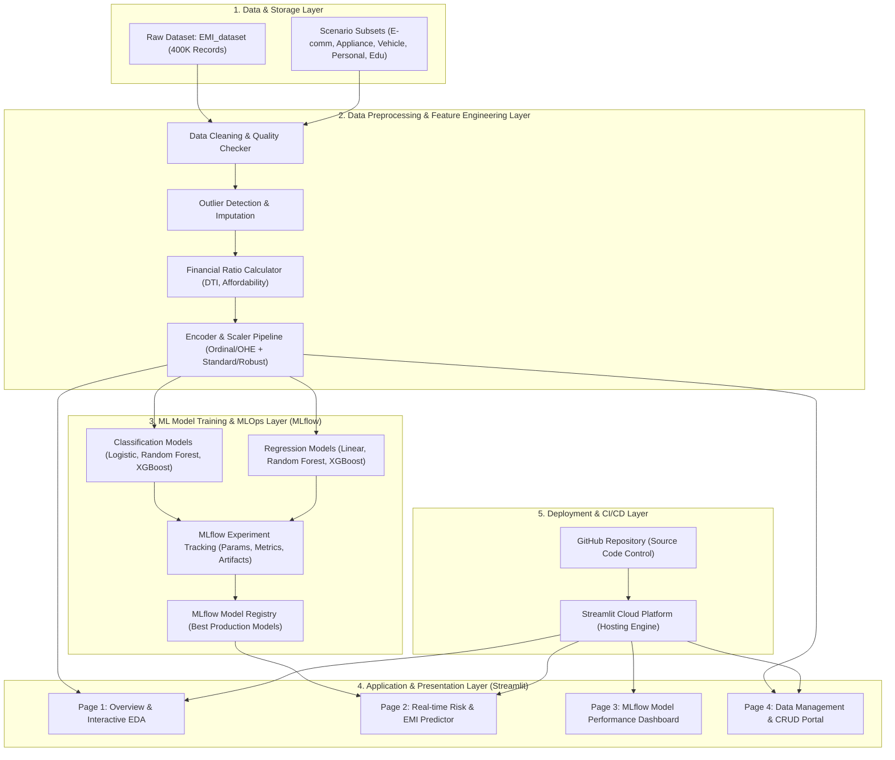
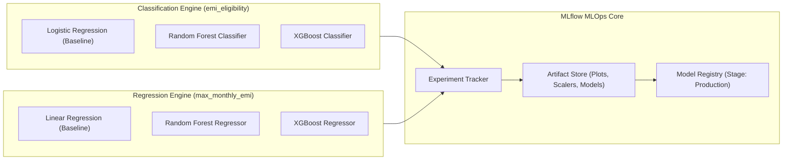
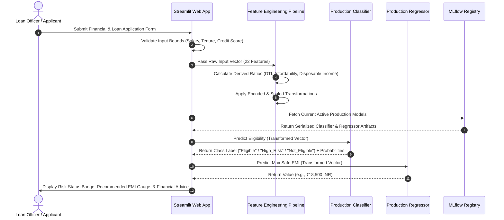

# System Architecture Document: EMIPredict AI

## 📌 1. System Overview & Architectural Principles

**EMIPredict AI** is an enterprise-grade, intelligent financial risk assessment platform designed to automate loan underwriting, predict EMI eligibility, and estimate maximum safe monthly EMI amounts across 400,000 financial records spanning 5 distinct lending scenarios.

### Core Architectural Principles
- **Decoupled Layered Architecture**: Clear separation of concerns between Data Ingestion, Preprocessing/Feature Engineering, Model Training & MLOps, Presentation (Streamlit), and Cloud Infrastructure.
- **Dual-Model Inference Engine**: Concurrent execution of Classification (`emi_eligibility`) and Regression (`max_monthly_emi`) pipelines.
- **MLOps Experiment Lineage**: Complete reproducibility using **MLflow** for experiment tracking, artifact logging, and model registry lifecycle management.
- **Real-Time Responsiveness**: Low-latency feature transformation and inference execution within the Streamlit presentation layer.
- **Scalability & Security**: Vectorized data operations using Pandas/NumPy, robust input validation, and secure cloud deployment via Streamlit Cloud.

---

## 🏗️ 2. High-Level Architecture Diagram



---

## 🧩 3. Detailed Component Breakdown

### 3.1 Layer 1: Data Ingestion & Storage Layer
- **Source Data**: `EMI_dataset` containing 400,000 historical financial profiles across 5 categories:
  1. *E-commerce Shopping EMI* (80,000 records)
  2. *Home Appliances EMI* (80,000 records)
  3. *Vehicle EMI* (80,000 records)
  4. *Personal Loan EMI* (80,000 records)
  5. *Education EMI* (80,000 records)
- **Format**: CSV / Parquet for high-speed I/O.
- **Storage Strategy**: Local data directory for raw and processed datasets; in-memory caching (`@st.cache_data`) for Streamlit performance.

---

### 3.2 Layer 2: Preprocessing & Feature Engineering Engine
- **Data Validation & Cleaning**:
  - Null value detection and domain-specific median/mode imputation.
  - Verification of logical numerical ranges (e.g., $age \in [25, 60]$, $credit\_score \in [300, 850]$).
  - Outlier handling via winsorization or clipping for extreme financial values.
- **Derived Financial Ratios**:
  $$\text{Debt-to-Income (DTI)} = \frac{\text{current\_emi\_amount}}{\text{monthly\_salary}}$$
  $$\text{Total Expense Ratio} = \frac{\text{rent} + \text{fees} + \text{travel} + \text{utilities} + \text{other}}{\text{monthly\_salary}}$$
  $$\text{Disposable Income} = \text{monthly\_salary} - (\text{total\_expenses} + \text{current\_emi\_amount})$$
  $$\text{Affordability Ratio} = \frac{\text{disposable\_income}}{\text{requested\_amount} / \text{requested\_tenure}}$$
  $$\text{Liquidity Reserve Ratio} = \frac{\text{bank\_balance} + \text{emergency\_fund}}{\text{requested\_amount}}$$
- **Encoding & Scaling**:
  - **Categorical Features**: One-Hot Encoding for nominal variables (`gender`, `employment_type`, `emi_scenario`) and Ordinal Encoding for ranked variables (`education`).
  - **Numerical Features**: `RobustScaler` or `StandardScaler` to prevent feature magnitude dominance during gradient boosting or linear model optimization.

---

### 3.3 Layer 3: Machine Learning & MLOps Subsystem



#### Classification Subsystem (`emi_eligibility`)
- **Target**: Multi-class (`Eligible`, `High_Risk`, `Not_Eligible`).
- **Algorithms**: Logistic Regression, Random Forest Classifier, XGBoost Classifier.
- **Primary Metrics**: Accuracy ($\ge 90\%$), Precision, Recall, F1-Score, ROC-AUC.

#### Regression Subsystem (`max_monthly_emi`)
- **Target**: Continuous EMI Capacity (₹500 – ₹50,000 INR).
- **Algorithms**: Linear Regression, Random Forest Regressor, XGBoost Regressor.
- **Primary Metrics**: Root Mean Squared Error (RMSE $< 2000$ INR), Mean Absolute Error (MAE), $R^2$ Score ($\ge 0.85$).

#### MLOps (MLflow) Integration
- **Tracking Server**: Logs hyperparameter configurations, metrics per epoch/iteration, confusion matrices, and feature importance plots.
- **Artifact Management**: Stores serialized preprocessing pipelines (`scaler.pkl`, `encoder.pkl`) alongside serialized models (`model.pkl` / `.onnx`).
- **Model Registry**: Enables version control and registers the best classification and regression models for deployment loading.

---

### 3.4 Layer 4: Presentation Layer (Multi-Page Streamlit App)

The user interface follows a clean, modular multi-page layout:

```
src/app/
├── 🏠_Home.py                          # Executive overview & system architecture status
├── pages/
│   ├── 1_📊_Overview_&_EDA.py          # Data distribution, scenario filtering, correlation matrix
│   ├── 2_🔮_Realtime_Risk_Predictor.py  # User input form, live inference, eligibility badge & EMI gauge
│   ├── 3_🧪_MLflow_Model_Dashboard.py  # Experiment comparison, model leaderboard, ROC curves
│   └── 4_⚙️_Data_Management_CRUD.py   # Dataset search, filter, add/edit profile records
```

#### Detailed Page Specifications
1. **Overview & EDA (`1_📊_Overview_&_EDA.py`)**:
   - Interactive scenario selector dropdown (e.g., E-commerce vs. Vehicle).
   - Correlation heatmaps of financial ratios vs. eligibility.
   - Box plots comparing salary vs. maximum monthly EMI capacity.
2. **Real-time Risk Predictor (`2_🔮_Realtime_Risk_Predictor.py`)**:
   - Dynamic form with inputs for all 22 demographics, financial, and loan fields.
   - Dual-model execution trigger:
     - Renders an eligibility status badge (**GREEN: Eligible**, **YELLOW: High Risk**, **RED: Not Eligible**).
     - Renders a gauge chart showing requested EMI vs. predicted safe `max_monthly_emi`.
3. **MLflow Model Dashboard (`3_🧪_MLflow_Model_Dashboard.py`)**:
   - Leaderboard table comparing classification & regression models logged in MLflow.
   - Interactive feature importance bar charts.
4. **Data Management CRUD Portal (`4_⚙️_Data_Management_CRUD.py`)**:
   - Data grid view with real-time searching and filtering.
   - CRUD modals to insert new financial profiles or update existing entries.

---

### 3.5 Layer 5: Deployment & CI/CD Layer

- **Source Control**: Managed via GitHub repo with structured branches (`main`, `dev`).
- **Hosting Engine**: **Streamlit Cloud** linked to `main` branch.
- **Automated Workflow**:
  ```mermaid
  gitGraph
      commit id: "Initial Commit"
      branch dev
      checkout dev
      commit id: "Add Preprocessing & Feature Pipeline"
      commit id: "Train Models & Log to MLflow"
      commit id: "Build Streamlit UI Pages"
      checkout main
      merge dev id: "Production Release v1.0"
      commit id: "Trigger Streamlit Cloud CI/CD Auto-Deploy"
  ```

---

## 🔄 4. Sequence Diagram: Real-Time Inference Flow



---

## 📁 5. Proposed Code Base Directory Structure

```
EMI Predict/
├── .github/
│   └── workflows/
│       └── deploy.yml              # CI/CD workflow definition
├── data/
│   ├── raw/
│   │   └── EMI_dataset.csv         # Raw 400K record dataset
│   └── processed/
│       ├── train.parquet           # Preprocessed training dataset
│       └── test.parquet            # Preprocessed testing dataset
├── docs/
│   ├── problemStatement.txt        # Original project brief
│   ├── context.md                  # Project context document
│   └── architecture.md             # System architecture documentation
├── mlruns/                         # MLflow local tracking store
├── models/                         # Serialized best production model artifacts
│   ├── preprocessor.pkl
│   ├── classifier_best.pkl
│   └── regressor_best.pkl
├── src/
│   ├── __init__.py
│   ├── preprocessing/
│   │   ├── cleaner.py              # Data cleaning and validation functions
│   │   └── feature_engineering.py  # Financial ratio calculators & transformers
│   ├── models/
│   │   ├── train_classifier.py     # Classification training & MLflow logging
│   │   ├── train_regressor.py      # Regression training & MLflow logging
│   │   └── evaluate.py             # Performance evaluation metrics
│   └── app/
│       ├── 🏠_Home.py              # Main Streamlit entry point
│       └── pages/
│           ├── 1_📊_Overview_&_EDA.py
│           ├── 2_🔮_Realtime_Risk_Predictor.py
│           ├── 3_🧪_MLflow_Model_Dashboard.py
│           └── 4_⚙️_Data_Management_CRUD.py
├── tests/
│   ├── test_preprocessing.py       # Unit tests for financial ratio logic
│   └── test_models.py              # Model output shape & range tests
├── requirements.txt                # Python dependency specifications
└── README.md                       # Project landing documentation
```

---

## 🛡️ 6. Reliability, Error Handling & Security

1. **Input Range Guardrails**: Form fields enforce strict domain constraints (e.g., $monthly\_salary \ge ₹15,000$, $credit\_score \in [300, 850]$) to prevent out-of-distribution model inputs.
2. **Model Loading Fallbacks**: If the MLflow Tracking Server is unreachable, the Streamlit app automatically falls back to local serialized `.pkl` model artifacts in `models/`.
3. **Data Quality Checks**: The ingestion engine uses strict schema checks to ensure required columns are present and correctly typed before pipeline execution.
4. **Memory Management**: Pandas computations leverage optimized column data types (`category`, `float32`, `int16`) to fit the 400,000 records easily within standard web app RAM limits.
