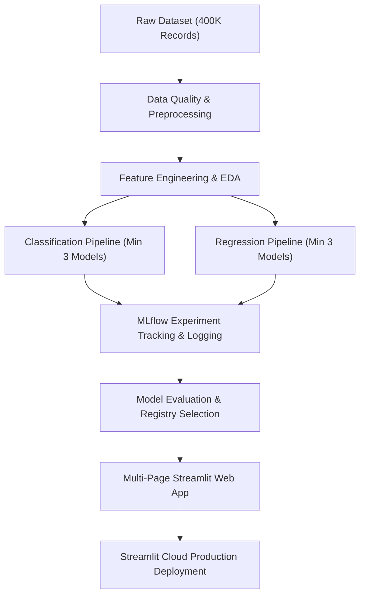

# Project Context: EMIPredict AI - Intelligent Financial Risk Assessment Platform

## 📌 Executive Summary
**EMIPredict AI** is an intelligent financial risk assessment platform designed for the FinTech and banking domains. It combines machine learning models with **MLflow** experiment tracking and a **Streamlit** multi-page web application to evaluate loan eligibility and predict maximum safe Equated Monthly Installments (EMI). 

By analyzing 400,000 financial records across 5 distinct lending scenarios, the platform automates underwriting decisions, reduces manual risk evaluation time by up to 80%, and provides data-driven financial insights for financial institutions, digital lenders, and loan officers.

---

## 🎯 Problem Statement & Core Objectives

### The Problem
Borrowers frequently face financial distress or loan defaults due to inadequate financial planning and inaccurate risk assessment by lenders. Manual loan underwriting is slow, subject to human error, and inconsistent across different loan types.

### Primary Objectives
1. **Dual Machine Learning Formulation**:
   - **Classification Target (`emi_eligibility`)**: Predict loan eligibility (`Eligible`, `High_Risk`, `Not_Eligible`).
   - **Regression Target (`max_monthly_emi`)**: Predict maximum safe monthly EMI capacity (500–50,000 INR).
2. **Big Data Processing**: Clean, validate, and analyze 400,000 financial records with 22 input features across 5 EMI scenarios.
3. **MLOps & Experiment Tracking**: Integrate **MLflow** for hyperparameter tracking, model registry, artifact storage, and performance comparisons.
4. **Production Web Application**: Develop a multi-page interactive **Streamlit** application featuring real-time predictions, EDA visualizer, MLflow dashboard, and CRUD data management.
5. **Cloud Deployment**: Host the application on **Streamlit Cloud** with automated GitHub CI/CD pipelines.

---

## 📊 Dataset & Scenario Architecture

### Dataset Overview (`EMI_dataset`)
- **Total Records**: 400,000 financial profiles
- **Total Input Features**: 22 variables
- **Target Variables**: 2 (Classification & Regression)
- **Scenarios**: 5 EMI lending categories (80,000 records each)

| EMI Scenario | Record Count | Loan Amount Range (INR) | Tenure Range |
| :--- | :--- | :--- | :--- |
| **E-commerce Shopping EMI** | 80,000 | ₹10,000 – ₹200,000 | 3 – 24 months |
| **Home Appliances EMI** | 80,000 | ₹20,000 – ₹300,000 | 6 – 36 months |
| **Vehicle EMI** | 80,000 | ₹80,000 – ₹1,500,000 | 12 – 84 months |
| **Personal Loan EMI** | 80,000 | ₹50,000 – ₹1,000,000 | 12 – 60 months |
| **Education EMI** | 80,000 | ₹50,000 – ₹500,000 | 6 – 48 months |

---

## 🔑 Feature Schema & Target Definitions

### Input Features (22 Variables)

#### 1. Personal Demographics
- `age`: Customer age (25–60 years)
- `gender`: Gender (`Male` / `Female`)
- `marital_status`: Marital status (`Single` / `Married`)
- `education`: Qualification level (`High School`, `Graduate`, `Post Graduate`, `Professional`)

#### 2. Employment & Income
- `monthly_salary`: Gross monthly income (₹15,000 – ₹200,000)
- `employment_type`: Category (`Private`, `Government`, `Self-employed`)
- `years_of_employment`: Work experience duration
- `company_type`: Organization size and type

#### 3. Housing & Family
- `house_type`: Ownership status (`Rented`, `Own`, `Family`)
- `monthly_rent`: Rental expenses
- `family_size`: Household members count
- `dependents`: Number of financial dependents

#### 4. Monthly Financial Obligations
- `school_fees`: Education expenses for dependents
- `college_fees`: Higher education costs
- `travel_expenses`: Transportation expenses
- `groceries_utilities`: Utility & grocery costs
- `other_monthly_expenses`: Miscellaneous expenses

#### 5. Financial Status & Credit History
- `existing_loans`: Current active loan status
- `current_emi_amount`: Existing monthly EMI burden
- `credit_score`: Credit score (300–850)
- `bank_balance`: Current liquid bank balance
- `emergency_fund`: Available emergency reserves

#### 6. Loan Application Details
- `emi_scenario`: Application category (5 EMI types)
- `requested_amount`: Desired loan principal amount
- `requested_tenure`: Preferred loan term in months

---

### Target Variables

| Target Name | Type | Description / Categories |
| :--- | :--- | :--- |
| `emi_eligibility` | **Classification** | • `Eligible`: Low risk, comfortable financial cushion • `High_Risk`: Marginal eligibility, requires higher interest rate • `Not_Eligible`: High risk, recommendation to reject |
| `max_monthly_emi` | **Regression** | Continuous value representing maximum safe monthly EMI capacity (₹500 – ₹50,000). Calculated from disposable income & risk scores. |

---

## 🏗️ Data Flow & System Architecture

### Architectural Layers
1. **Data Layer**: Ingestion & validation of structured financial dataset across 5 lending scenarios.
2. **Processing Layer**: Cleaning missing values, categorical encoding, feature scaling, ratio derivation (Debt-to-Income, Affordability).
3. **Model Layer**: Classification (Logistic Regression, Random Forest, XGBoost) & Regression (Linear Regression, Random Forest, XGBoost) tracked via **MLflow**.
4. **Application Layer**: Multi-page **Streamlit** GUI with real-time risk assessment, data management, and visual analytics.
5. **Deployment Layer**: **Streamlit Cloud** hosting wired to GitHub repo for continuous integration.

---

## ⚙️ Technical Approach & Project Roadmap

1. **Step 1: Data Preprocessing & Validation**
   - Handle missing data, zero/negative variances, outlier detection, and split into train/validation/test sets.
2. **Step 2: Exploratory Data Analysis (EDA)**
   - Analyze risk distributions across demographics, EMI scenarios, salary bands, and financial ratios.
3. **Step 3: Feature Engineering**
   - Compute key financial metrics:
     - Debt-to-Income (DTI) Ratio
     - Expense-to-Income Ratio
     - EMI Affordability Index
     - Credit & Reserves Risk Factor
4. **Step 4: Model Development & Evaluation**
   - **Classification**: Train Logistic Regression, Random Forest, XGBoost (Eval: Accuracy > 90%, F1, ROC-AUC).
   - **Regression**: Train Linear Regression, Random Forest, XGBoost (Eval: RMSE < 2000 INR, MAE, R²).
5. **Step 5: MLflow Integration**
   - Log parameters, metrics, feature importances, artifacts, and promote top models to MLflow Model Registry.
6. **Step 6: Streamlit Application Building**
   - Build multi-page interface: Overview/EDA, Real-time EMI Evaluator, Model Performance & MLflow Tracker, Admin Data Management (CRUD).
7. **Step 7: Production Cloud Deployment**
   - Deploy on Streamlit Cloud with environment secrets, error boundaries, and response optimization.

---

## 💡 Business Impact & Use Cases

- **Financial Institutions**: Automate manual underwriting process, slashing turnaround time by 80%.
- **FinTech Digital Lenders**: Embed instant EMI qualification into web and mobile lending funnels.
- **Banks & Credit Agencies**: Risk-adjusted loan amount recommendations, portfolio monitoring, regulatory transparency.
- **Underwriters**: AI decision support tool for rapid profile assessment and risk auditing.

---

## 🛠️ Technology Stack & Tools

- **Programming Language**: Python 3.x
- **Data Manipulation & Analysis**: Pandas, NumPy
- **Machine Learning & Modeling**: Scikit-Learn, XGBoost, LightGBM
- **MLOps & Experiment Tracking**: MLflow (Tracking Server, Model Registry)
- **Web Application**: Streamlit (Multi-page architecture)
- **Visualization**: Plotly, Seaborn, Matplotlib
- **Deployment & Version Control**: Streamlit Cloud, Git / GitHub

---

## 📐 Benchmark Metrics & Success Criteria

- **Classification Benchmark**: Accuracy $\ge$ 90%, high F1-score across all 3 eligibility tiers.
- **Regression Benchmark**: RMSE $<$ ₹2,000 INR, $R^2 > 0.85$.
- **System Evaluation Weight**:
  - **70% Technical Execution**: Preprocessing completeness, 3+ models per task, MLflow tracking & registry.
  - **30% App & Deployment**: Streamlit UX, real-time prediction responsiveness, cloud stability.
